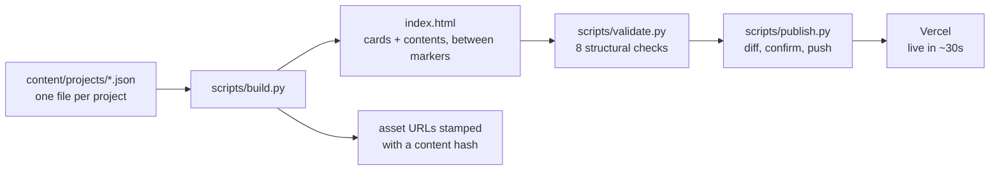

# Vivaan Jain

**Quantitative Researcher** · Systematic Equity · Mumbai, India

[vivaan-jain-portfolio.vercel.app](https://vivaan-jain-portfolio.vercel.app) &nbsp;·&nbsp;
[LinkedIn](https://www.linkedin.com/in/vivaan-jain-398160279) &nbsp;·&nbsp;
[Medium](https://medium.com/@vivaan.jain246) &nbsp;·&nbsp;
[vivaan.jain246@gmail.com](mailto:vivaan.jain246@gmail.com)

> *The first principle is that you must not fool yourself — and you are the easiest person to fool.*
> — Richard Feynman

---

## Abstract

I build and operate systematic equity strategies on Indian markets, and I own the whole chain:
point-in-time data from primary NSE sources, cross-sectional signals, portfolio construction under
the full cost stack, and the validation machinery that decides whether a result is skill or luck.
One book trades itself nightly against real closes and alarms when it goes quiet.

The most useful thing I have produced is a documented list of what does **not** work. That is not
modesty. In this field a beautiful backtest is the default outcome of insufficient care, and the
only interesting question about a number is what had to be true for it to survive being counted.

Mathematics came first and everything here is downstream of it: olympiad rounds at school, then the
entrance papers, and now the parts of the degree the work actually runs on — statistical modelling
and operational research. Markets are what I point it at.

---

## Notation

Used throughout this repository and across the projects below.

| Symbol | Meaning |
|---|---|
| **IC** | Spearman rank correlation between a signal and the forward return it predicts |
| **Sharpe** | Annualised mean excess return over its standard deviation. Always net of costs here |
| **DSR** | Deflated Sharpe — discounted for how many configurations were tried. Below 0.95 is not an edge |
| **PBO** | Probability of backtest overfitting. Share of splits where the in-sample winner loses out of sample. 0.5 is a coin flip |
| **CPCV** | Combinatorially purged cross-validation. Purge and embargo between train and test so overlapping labels cannot leak |
| **SPA** | Hansen's Superior Predictive Ability test — does the best strategy in a family beat the benchmark once the whole family is counted |

---

## 1 · Selected results

| Project | What it is | Result |
|---|---|---|
| **[Artha](https://github.com/vj0246/artha)** | Weekly cross-sectional momentum book on NSE equities. Researched, validated, and operated live on ₹0 of paid data | Net **Sharpe 1.02**, **13.7% CAGR**, **−28%** max drawdown, 2012–2026, after the complete Indian cost stack |
| **[FullBacktester](https://github.com/vj0246/Backtesting-Framework)** | Backtesting library where look-ahead is a construction error rather than a discipline problem | Two engines agreeing to **1e-9**; AST and perturbation leakage detectors; DSR and PBO as first-class metrics |
| **[Overnight Return Prediction](https://github.com/vj0246/Overnight-Return-Predictor)** | Overnight gap across 208 NSE symbols: magnitude, direction, calibrated confidence, four independently fitted models | Pooled **rank IC 0.178** at t = 24.5, calibration error **0.021**, and a residual direction score of **0.0001** that the write-up leads with |
| **[Multi-Horizon Transformer](https://github.com/vj0246/Multi-Horizon-Transformer-for-Systematic-Equity-Direction-Forecasting)** | Transformer encoder forecasting Nifty 50 direction across multiple horizons from one forward pass | 18 years of sessions, walk-forward validation, leakage-free scaling, a backtester written from scratch |

Full write-ups, architecture and protocol for each: **[the site](https://vivaan-jain-portfolio.vercel.app)**.

---

## 2 · Things that did not work

Nulls are the expensive output of research, and the reason to trust the rest. From Artha:

- **Machine learning does not beat momentum.** Ridge, LightGBM, MLP and a Transformer under one
  purged protocol. **PBO 0.86** — the in-sample winner is overfit in 24 of 28 splits.
- **Post-earnings drift runs backwards in India.** Across 1.48M timestamped exchange announcements
  the biggest positive surprises *reverse*, t = −6.9.
- **The single-name model zoo loses to buy-and-hold.** GRU, LSTM, Transformer, ensemble — all under
  half the always-long floor after costs. Retraining cadence turned out irrelevant: the problem is
  absence of signal, not staleness.
- **News sentiment gating subtracts value** — 0.06 against 0.58 Sharpe.
- **A learned trading-speed policy ties the fixed constant.** LinUCB over 728 weekly decisions:
  PBO 0.93 and near-uniform action counts. The agent reporting that the surface is flat.

And the one written up as a working paper:

> **Decomposition preprocessing is look-ahead.** A large literature reports Sharpe 3+ on daily
> equity forecasting after EMD/CEEMDAN preprocessing. I reproduced those numbers exactly — IC 0.41,
> Sharpe 3.6 — then recomputed the identical transform *causally*, so no future data could touch any
> training input. The entire edge vanished: **IC −0.04**. The leaky-minus-causal gap is the result.

Things I caught myself getting wrong, and fixed in public: a corporate-action feed that
manufactured a +398% phantom return, a position-cap bug that inflated a headline Sharpe from 1.018
to 1.119, and a significance claim corrected from p = 0.0415 to p = 0.655 once the baseline inside
the family was accounted for. All three stay in the record.

---

## 3 · Background

**B.Tech. Computer Engineering**, Dwarkadas J. Sanghvi College of Engineering, Mumbai · 2024–2028 ·
CGPA **9.25/10** · Honours in Data Science

| Course | Grade |
|---|---|
| Mathematics I | **10** / 10 |
| Mathematics II | **10** / 10 |
| Statistical Modelling | **10** / 10 |
| Operational Research | 9 / 10 |
| Advanced Operational Research | 9 / 10 |

Second prize, SOF International Mathematical Olympiad (school level). MHT-CET 99 overall, 98.6 in
mathematics. JEE Main 95.4 in the mathematics section. First prize, Urban Empire — a constrained
budget-allocation problem, which is the same shape as sizing a book.

---

## 4 · This repository

The portfolio site itself. Static single page, no framework, no bundler — but project cards are
**data, not markup**.



Adding a project is one file:

```bash
cp content/projects/_TEMPLATE.json content/projects/proj-050-newthing.json
# edit it
python scripts/publish.py
```

Card numbers (`1.1`, `2.1`, `3.1`) and the contents list on the first screen are **derived**, so
inserting a project renumbers everything below it and updates the index on its own. CI fails the
commit if `index.html` ever disagrees with the JSON it came from.

| Path | What it is |
|---|---|
| `content/projects/` | One JSON file per project. The source of truth |
| `scripts/build.py` | Renders cards and contents into `index.html`, hashes asset URLs |
| `scripts/validate.py` | Tag balance, anchors, duplicate ids, inline handlers, JSON-LD, numbering, contents, assets |
| `scripts/publish.py` | Build, validate, diff, confirm, rebase, push |
| `scripts/fetch_data.py` | Daily GitHub API pull for the activity strip |
| `js/main.js` | All page behaviour. No inline script, no inline handlers |
| `PIPELINE.md` | The full maintenance guide |

Design is deliberately narrow: near-black slate, one muted slate-blue accent, desaturated green and
red for signed numbers, serif for the page and mono for every number. Sections are numbered like a
paper because the page is meant to be *read*, not toured.

---

## 5 · Elsewhere

Also build production AI systems when the research is not the point — agentic equity tooling,
multi-tenant RAG with hybrid retrieval, and a multilingual ASR and diarization pipeline running in
production across 13 Indian languages. Those live in **§3 Engineering** on the site.

**Open to quantitative research internships.** If you're hiring, tell me what the desk actually
trades and what the first six months look like. Email is fastest.
